# 기술경력서

## 링크

Github : https://github.com/Jino0910

Bitbucket : https://bitbucket.org/rowkaxl

Blog : https://jino0910.github.io/

## 목차 
<!--toc start-->
   * [링크](#링크)
   * [목차](#목차)
   * [경력](#경력)
   * [회사 프로젝트](#회사-프로젝트)
      * [보맵](#보맵)
      * [설계사용 보맵](#설계사용-보맵)
      * [PandoraTV](#PandoraTV)
      * [WorkinMap](#WorkinMap)
      * [아이웨딩](#아이웨딩)
      * [결혼준비체크리스트](#결혼준비체크리스트)
      * [모바일 청첩장](#모바일-청첩장)
      * [렉서스 고객용앱](#렉서스-고객용앱)
      * [에이미존](#에이미존)
      * [파크히어](#파크히어)
      * [PuzzleWorld](#PuzzleWorld)
      * [HorrorCall](#HorrorCall)
      * [뭉카](#뭉카)
   * [개인 프로젝트](#개인-프로젝트)
      * [CYANO](#CYANO)
      * [Youth](#Youth)
      * [힐스킨](#힐스킨)
      * [Schedule](#Schedule)

<!--/toc end-->

## 경력

[보맵](http://bomapp.co.kr/)
- iOS팀장 - 2019.01.24 ~ now
- 사원 - 2017.02.21 ~ 2019.01.23

[판도라티비](http://www.pandora.tv/)
- 2016.04 ~ 2017.02

[아이패밀리SC](https://www.ifamily.co.kr/)
- 2013.11 ~ 2016.01

[에이엔티홀딩스](http://www.ant-holdings.com/)
- 2012.09 ~ 2013.10

[지엔지커머스](http://domeggook.com/)
- 2011.07 ~ 2011.08

## 회사 프로젝트

### 보맵
- 소속 : 보맵 
- 역할 : iOS 앱 개발
- 사용기술 : Swift, RxSwift, Realm, SnapKit, Autolayout, Lottie, Jenkins, Fastlane, Fabric, Firebase, Amplitude, MVVM, CleanSwift
- 기타 : objective-c -> swift로 스팩업 
- [AppStore](https://itunes.apple.com/kr/app/%EB%B3%B4%EB%A7%B5-%EB%B3%B4%ED%97%98%EC%9D%98-%EC%83%88%EB%A1%9C%EC%9A%B4-%EA%B2%BD%ED%97%98%EA%B3%BC-%EA%B0%80%EC%B9%98%EB%A5%BC-%EC%A0%9C%EA%B3%B5%ED%95%A9%EB%8B%88%EB%8B%A4/id1187829462?mt=8)

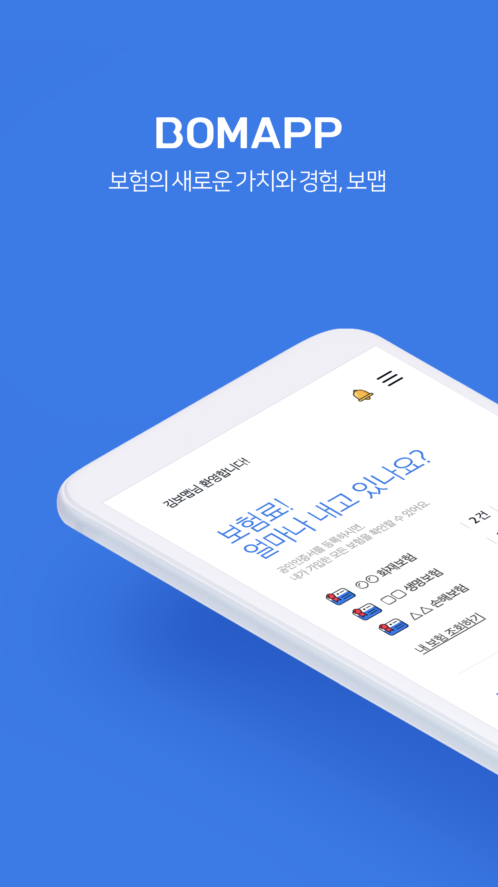 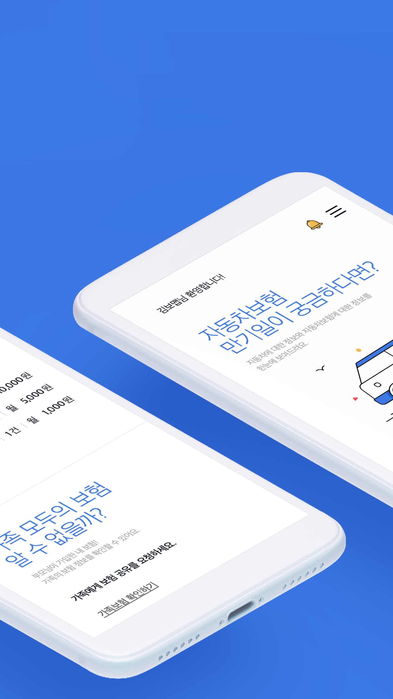   

### 설계사용 보맵
- 소속 : 보맵 
- 역할 : iOS 앱 개발
- 사용기술 : Swift, RxSwift, Realm, SnapKit, Autolayout, Lottie, Jenkins, Fastlane, Fabric, Firebase, Amplitude, MVVM, CleanSwift
- [AppStore](https://itunes.apple.com/kr/app/%EB%B3%B4%EB%A7%B5-%EC%84%A4%EA%B3%84%EC%82%AC%EC%9A%A9-%EC%8A%A4%EB%A7%88%ED%8A%B8%ED%95%9C-%EC%98%81%EC%97%85%EC%9D%98-%EC%8B%9C%EC%9E%91/id1215542257)

 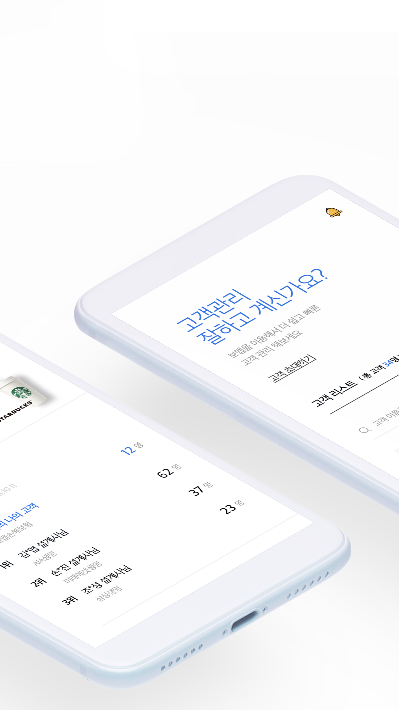   

### PandoraTV
- 소속 : 판도라티비 
- 역할 : iOS 앱 개발
- 사용기술 : Objective-c, AFNetworking, PureLayout, Pop, Fabric
- [AppStore](https://itunes.apple.com/kr/app/pandoratv/id402122832?mt=8)

 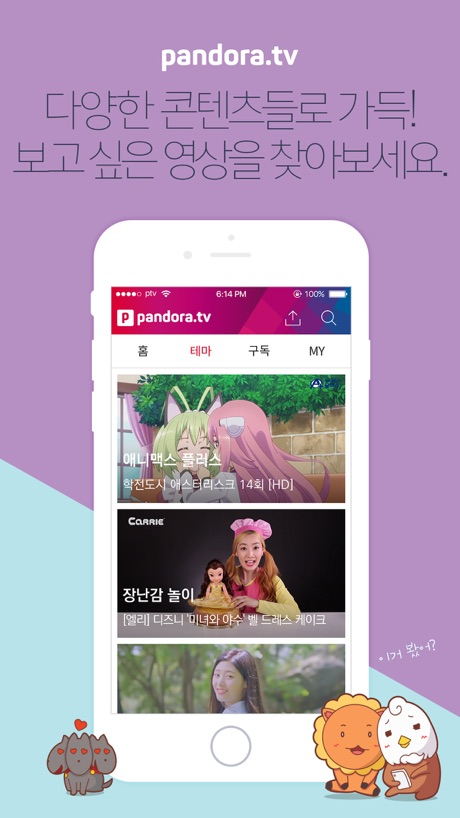   

### WorkinMap 
- 소속 : 판도라티비 
- 역할 : iOS 앱 개발
- 사용기술 : Objectivce-c, Googlemap clustering, Firebase
- [AppStore](https://itunes.apple.com/kr/app/work-in-map-wokinmaeb-eobmu/id1181774972?mt=8)

    

### 아이웨딩
- 소속 : 아이패밀리SC 
- 역할 : iOS 앱 개발, 서버 개발(일부참여)
- 사용기술 : Objective-c, AFNetworking, php, mysql, jquery
- [AppStore](https://itunes.apple.com/kr/app/%EC%95%84%EC%9D%B4%EC%9B%A8%EB%94%A9/id406943343?mt=8)

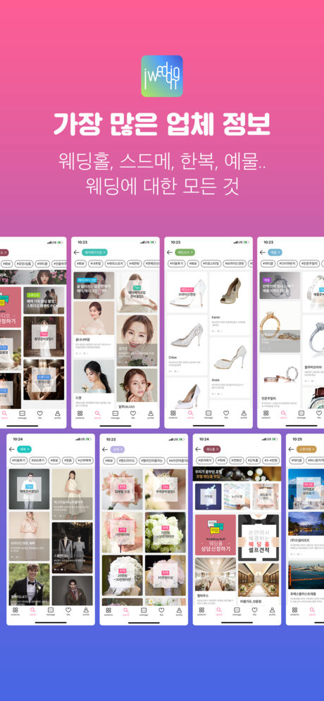 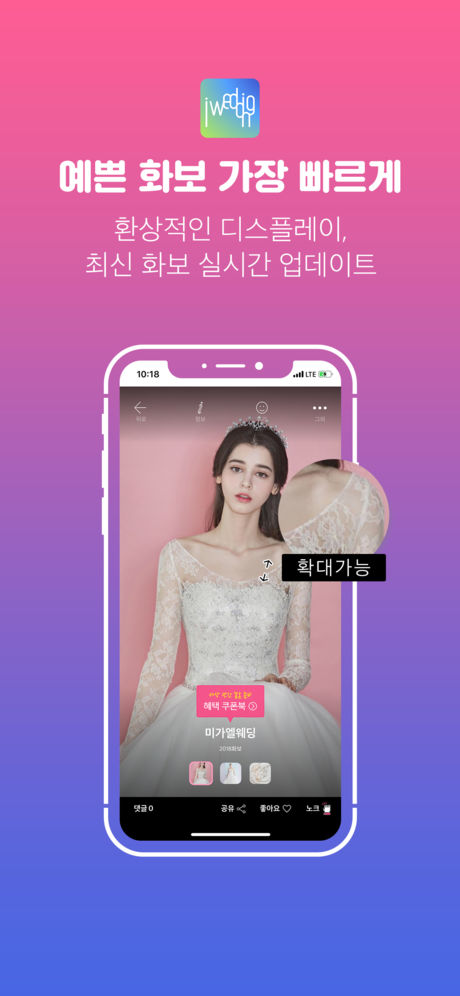  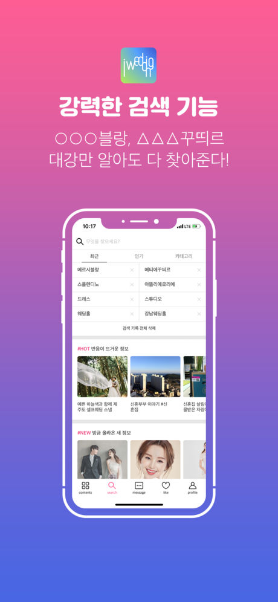 

### 결혼준비체크리스트
- 소속 : 아이패밀리SC 
- 역할 : iOS 앱 개발
- 사용기술 : Objective-c, AFNetworking
- [AppStore](https://itunes.apple.com/kr/app/%EA%B2%B0%ED%98%BC%EC%A4%80%EB%B9%84%EC%B2%B4%ED%81%AC%EB%A6%AC%EC%8A%A4%ED%8A%B8/id871072606)

     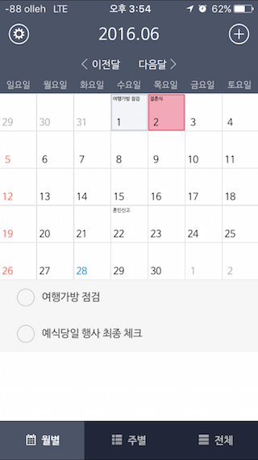 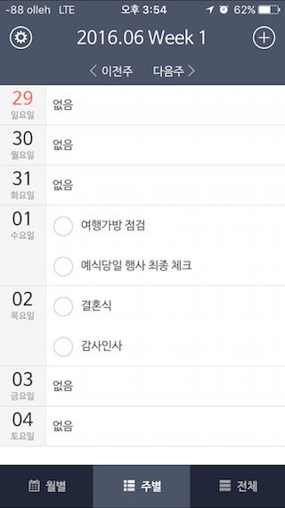 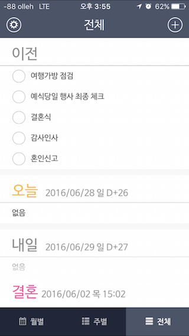

### 모바일 청첩장
- 소속 : 아이패밀리SC 
- 역할 : iOS 앱 개발, 서버 개발
- 사용기술 : Objective-c, AFNetworking, php, mysql
- [AppStore](https://itunes.apple.com/kr/app/%EB%AA%A8%EB%B0%94%EC%9D%BC-%EC%B2%AD%EC%B2%A9%EC%9E%A5/id933104370)

   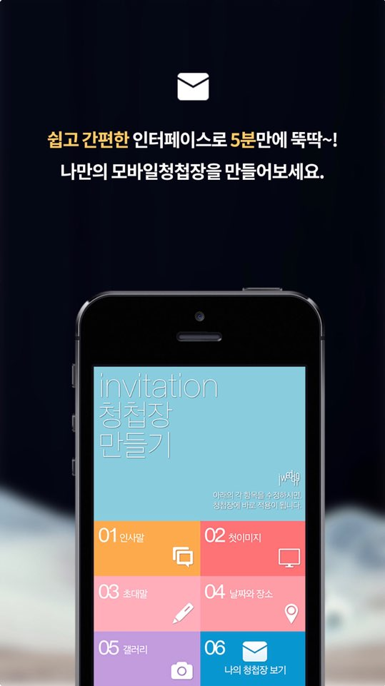 

### 렉서스 고객용앱
- 소속 : 아이패밀리SC 
- 역할 : iOS 앱 개발
- 사용기술 : Objective-c, sqlite
- [AppStore](https://itunes.apple.com/kr/app/%EB%A0%89%EC%84%9C%EC%8A%A4-%EA%B3%A0%EA%B0%9D%EC%9A%A9%EC%95%B1/id933624318?mt=8)

  

### 에이미존
- 소속 : 아이패밀리SC 
- 역할 : 웹 개발
- 사용기술 : php, codeigniter, mysql, jquery, css, html
- <http://www.amyzon.co.kr/>

### 파크히어
- 소속 : 에이엔티홀딩스
- 역할 : iOS 앱 개발
- 사용기술 : Objective-c
- 서비스 종료(카카오 T 주차로 변경)

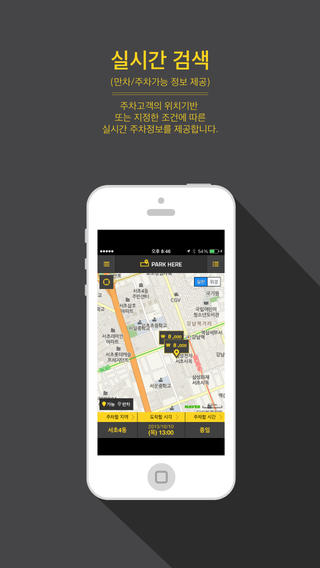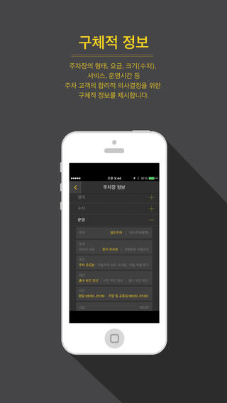 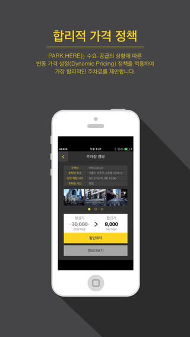 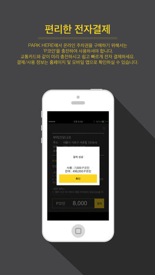 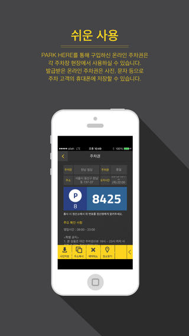

### PuzzleWorld
- 소속 : 에이엔티홀딩스
- 역할 : iOS 앱 개발, 서버 개발
- 사용기술 : Objective-c, cocos2d, php, mysql
- 서비스 종료

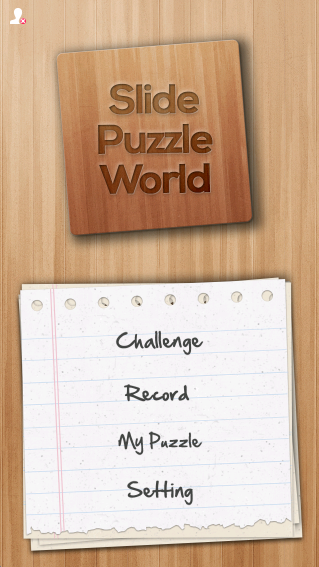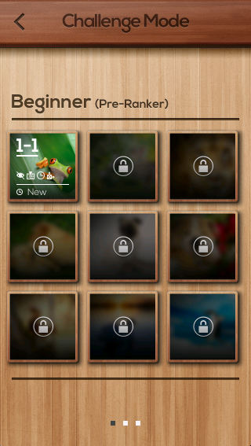 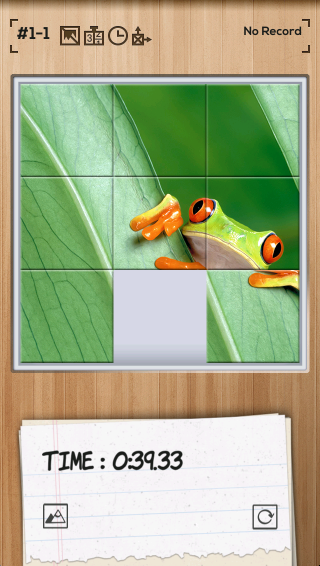 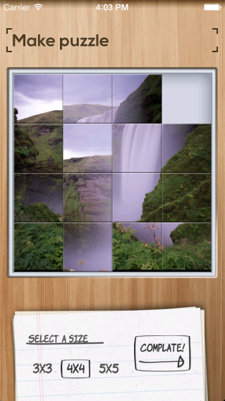 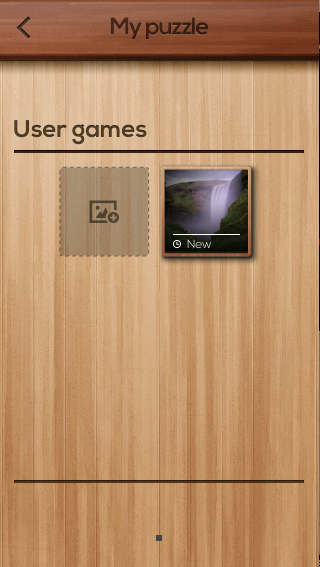

### HorrorCall
- 소속 : 에이엔티홀딩스
- 역할 : iOS 앱 개발
- 사용기술 : Objective-c
- 서비스 종료

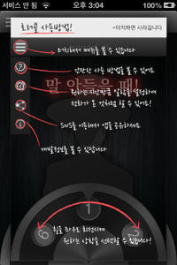   

### 뭉카
- 소속 : 에이엔티홀딩스
- 역할 : iOS 앱 개발
- 사용기술 : Objective-c
- 서비스 종료

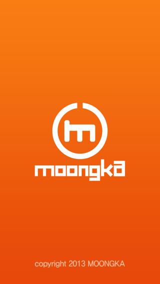   

## 개인 프로젝트

### CYANO

수중 다이버들의 기록을 저장하기 위한 앱

- 사용기술 : Objectivce-c, php, mysql, Ble4.0, Serial Communication
- 역할 : iOS 앱 개발, 서버 개발
- [AppStore](https://itunes.apple.com/kr/app/cyano-divecomputer/id1300443116?mt=8)

  

### Youth

전자스케이트보드 속도 조절 컨트롤러앱

- 사용기술 : Objectivce-c, php, mysql, Ble4.0, Serial Communication
- 역할 : iOS 앱 개발, 서버 개발
- 앱 서비스 종료

   

### 힐스킨

피부의 범위를 측정할 수 있도록 특수 제작된 힐스킨 렌즈를 스마트폰의 고화질 카메라에 연결하여 자신의 피부 상태체크

- 사용기술 : Objective-c, sqlite
- 역할 : iOS 앱 개발
- [AppStore](https://itunes.apple.com/kr/app/healskin/id1050898124?mt=8)

   

### Schedule

대학교 시간표 앱

- 사용기술 : Objective-c, sqlite
- 역할 : iOS 앱 개발
- 서비스 종료 

  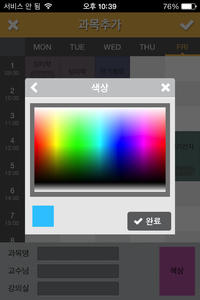  
