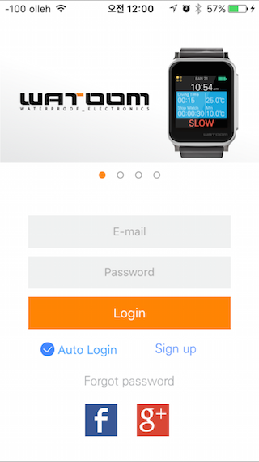
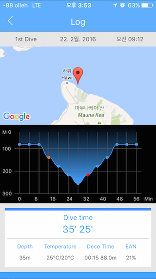

# 기술경력서

## 링크

Github : https://github.com/Jino0910

Bitbucket : https://bitbucket.org/rowkaxl

Blog : https://medium.com/@rowkaxl (medium으로 옮기는중)

## 목차 
<!--toc start-->
   * [링크](#링크)
   * [목차](#목차)
   * [경력](#경력)
   * [회사 프로젝트](#회사-프로젝트)
      * [보맵](#보맵)
      * [설계사용 보맵](#설계사용-보맵)
      * [PandoraTV](#PandoraTV)
   * [개인 프로젝트](#개인-프로젝트)
      * [WorkinMap](#WorkinMap)
      * [CYANO](#CYANO)
      * [Youth](#Youth)
<!--/toc end-->

## 경력

[보맵](http://bomapp.co.kr/)
- 팀장 - 2019.01.24 ~ now
- 사원 - 2017.02.21 ~ 2019.01.23

[판도라티비](http://www.pandora.tv/)
- 2016.04 ~ 2017.02

[아이패밀리SC](https://www.ifamily.co.kr/)
- 2013.11 ~ 2016.01

[에이엔티홀딩스](http://www.ant-holdings.com/)
- 2012.09 ~ 2013.10

[지엔지커머스](http://domeggook.com/)
- 2011.07 ~ 2011.08

## 회사 프로젝트

### 보맵
- 소속 : 보맵 
- 역할 : iOS 앱 개발
- 사용기술 : iOS, Swift, RxSwift, Realm, SnapKit, Autolayout, Lottie, Jenkins, Fastlane, fabric, firebase, amplitude, MVVM, CleanSwift
- 기타 : objective-c -> swift로 스팩업 
- AppStore (https://itunes.apple.com/kr/app/%EB%B3%B4%EB%A7%B5-%EB%B3%B4%ED%97%98%EC%9D%98-%EC%83%88%EB%A1%9C%EC%9A%B4-%EA%B2%BD%ED%97%98%EA%B3%BC-%EA%B0%80%EC%B9%98%EB%A5%BC-%EC%A0%9C%EA%B3%B5%ED%95%A9%EB%8B%88%EB%8B%A4/id1187829462?mt=8)

    

### 설계사용 보맵
- 소속 : 보맵 
- 역할 : iOS 앱 개발
- 사용기술 : iOS, Swift, RxSwift, Realm, SnapKit, Autolayout, Lottie, Jenkins, Fastlane, fabric, firebase, amplitude, MVVM, CleanSwift
- AppStore (https://itunes.apple.com/kr/app/%EB%B3%B4%EB%A7%B5-%EC%84%A4%EA%B3%84%EC%82%AC%EC%9A%A9-%EC%8A%A4%EB%A7%88%ED%8A%B8%ED%95%9C-%EC%98%81%EC%97%85%EC%9D%98-%EC%8B%9C%EC%9E%91/id1215542257)

    

### PandoraTV
- 소속 : 판도라티비 
- 역할 : iOS 앱 개발
- 사용기술 : iOS, objective-c, AFNetworking, PureLayout, pop, fabric
- AppStore (https://itunes.apple.com/kr/app/pandoratv/id402122832?mt=8)

    

## 개인 프로젝트

### WorkinMap 

거래처 관리 지도

- 기간: 2016/11/1 ~ 2017/01/31
- 사용기술 : Objectivce-c, Googlemap clustering, Firebase
- AppStore (https://itunes.apple.com/kr/app/work-in-map-wokinmaeb-eobmu/id1181774972?mt=8)

    

### CYANO

수중 다이버들의 기록을 저장하기 위한 앱

- 사용기술 : Objectivce-c, Ble4.0 Protocol Network
- AppStore (https://itunes.apple.com/kr/app/cyano-divecomputer/id1300443116?mt=8)

  

### Youth

전자스케이트보드 속도 조절 컨트롤러앱

- 사용기술 : Objectivce-c, Ble4.0 Protocol Network
- 앱 서비스 종료

   

### 힐스킨

피부의 범위를 측정할 수 있도록 특수 제작된 힐스킨 렌즈를 스마트폰의 고화질 카메라에 연결하여 자신의 피부 상태체크

- 사용기술 : Objective-c
- AppStore (https://itunes.apple.com/kr/app/healskin/id1050898124?mt=8)

   
